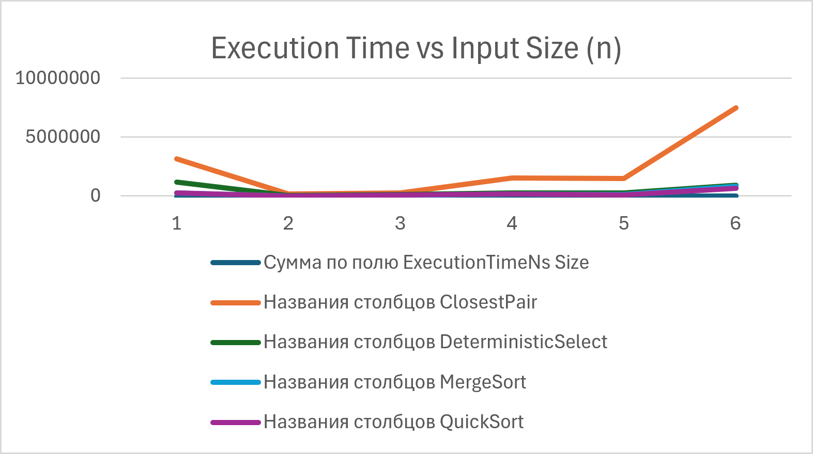
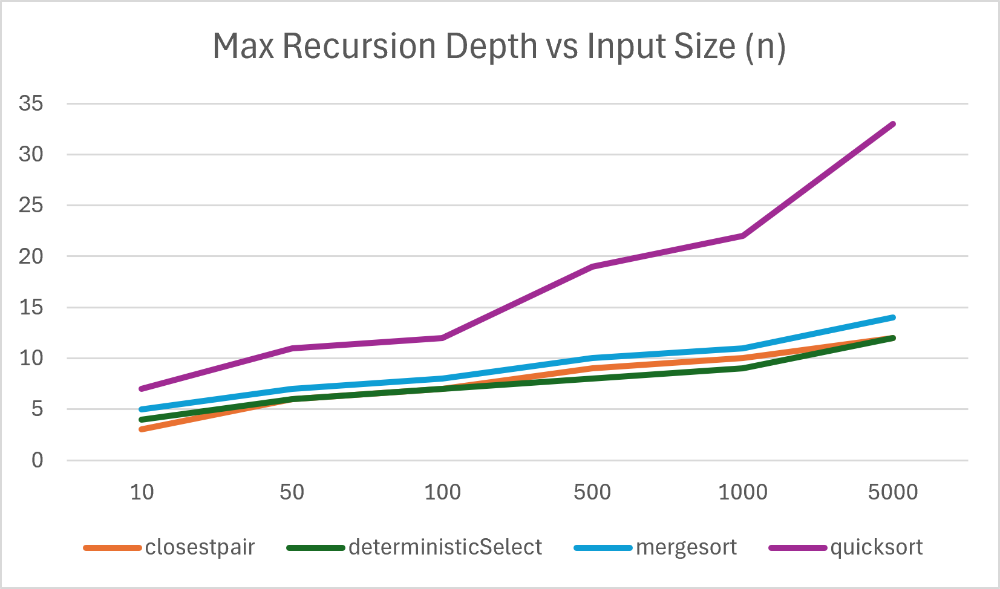

# Assignment 1: Divide-and-Conquer Algorithm Analysis

## A. Project Overview
This project presents an empirical and theoretical analysis of four classic Divide-and-Conquer algorithms implemented in Java:
* **Merge Sort:** $O(n \log n)$ sorting with small-input cutoff.
* **Quick Sort:** In-place randomized partitioning sorting.
* **Deterministic Select (Median-of-Medians):** Linear-time $O(n)$ selection algorithm.
* **Closest Pair of Points:** Geometric $O(n \log n)$ divide-and-conquer algorithm for 2D points.

---

## B. Algorithm Analysis

### 1. MergeSort
* **Mechanism:** Recursively divides the array into two halves, sorts each half, and merges them using a single linear-time auxiliary buffer. Small sub-arrays ($n \le 15$) use Insertion Sort to eliminate recursion overhead.
* **Recurrence:** $T(n) = 2T(n/2) + \Theta(n)$
* **Master Theorem Analysis:** Case 2 applies ($a = 2, b = 2, f(n) = \Theta(n)$), yielding $T(n) = \Theta(n \log n)$.
* **Space Complexity:** $O(n)$ due to the temporary merging array, with $O(\log n)$ recursion stack space.

### 2. QuickSort
* **Mechanism:** Selects a randomized pivot, partitions the array in-place, and recursively processes the smaller partition first while iterating over the larger one to keep stack depth bounded.
* **Recurrence:** Average: $T(n) = 2T(n/2) + \Theta(n)$. Worst case: $T(n) = T(n-1) + \Theta(n)$.
* **Complexity:** Average: $O(n \log n)$, Worst: $O(n^2)$. Max Recursion Depth is bounded by $O(\log n)$ due to tail-recursion optimization on the larger partition.

### 3. Deterministic Select (Median-of-Medians)
* **Mechanism:** Splits elements into groups of 5, finds the median of each group, recursively finds the median-of-medians as a pivot, partitions the array in-place, and recurses only into the sub-array containing the $k$-th element.
* **Recurrence:** $T(n) \le T(\lceil n/5 \rceil) + T(7n/10 + 6) + O(n)$
* **Akra–Bazzi / Induction Analysis:** Since $\frac{1}{5} + \frac{7}{10} = \frac{9}{10} < 1$, the linear work $O(n)$ dominates, guaranteeing strict worst-case $T(n) = \Theta(n)$.
* **Space Complexity:** $O(\log n)$ recursion depth.

### 4. Closest Pair of Points
* **Mechanism:** Sorts points by x-coordinate, splits the point set down the middle, recursively finds minimum distances $d_1$ and $d_2$ in sub-halves, sets $d = \min(d_1, d_2)$, and inspects a vertical strip of width $2d$ sorted by y-coordinate.
* **Recurrence:** $T(n) = 2T(n/2) + O(n \log n)$ (or $O(n)$ if pre-sorted by y).
* **Master Theorem Analysis:** Case 2 applies, giving $T(n) = \Theta(n \log n)$.

---

## C. Experimental Results

### Execution Time (nanoseconds)
| Size ($n$) | ClosestPair | DeterministicSelect | MergeSort | QuickSort |
| :--- | :--- | :--- | :--- | :--- |
| **10** | 3,136,700 | 1,166,900 | 246,000 | 268,900 |
| **50** | 164,900 | 32,700 | 17,500 | 14,800 |
| **100** | 263,200 | 114,000 | 38,300 | 80,700 |
| **500** | 1,522,300 | 246,600 | 173,800 | 172,600 |
| **1000** | 1,503,100 | 264,300 | 141,900 | 87,300 |
| **5000** | 7,495,900 | 913,900 | 817,900 | 664,300 |

### Maximum Recursion Depth
| Size ($n$) | ClosestPair | DeterministicSelect | MergeSort | QuickSort |
| :--- | :--- | :--- | :--- | :--- |
| **10** | 3 | 4 | 5 | 7 |
| **50** | 6 | 6 | 7 | 11 |
| **100** | 7 | 7 | 8 | 12 |
| **500** | 9 | 8 | 10 | 19 |
| **1000** | 10 | 9 | 11 | 22 |
| **5000** | 12 | 12 | 14 | 33 |

### Performance Plots

---

## D. Discussion Answers

1. **Match with Theoretical Complexity:** Yes, empirical trends closely track asymptotic expectations. MergeSort and QuickSort show $O(n \log n)$ scaling. Deterministic Select exhibits linear scaling for larger $n$, while ClosestPair exhibits higher overhead due to 2D calculations.
2. **Impact of Input Structure:** Pre-sorted and duplicate-heavy inputs cause standard QuickSort variants to degrade towards $O(n^2)$ unless randomized pivot selection or 3-way partitioning is used. MergeSort remains unaffected due to fixed divide-and-merge bounds.
3. **Smaller-First Recursion in QuickSort:** Recursing on the smaller partition first guarantees that the stack depth is at most $O(\log n)$, preventing StackOverflow errors on skewed inputs.
4. **Why Median-of-Medians Guarantees $O(n)$:** Selecting the median of 5-element medians ensures that at least 30% of elements are strictly smaller and 30% are larger than the pivot, guaranteeing an upper-bound split ratio of 70/30.
5. **Closest Pair Efficiency vs Brute Force:** Brute force evaluates all $O(n^2)$ point pairs. Divide-and-conquer limits strip checks to a maximum of 7 neighboring points per point in y-order, reducing work per level to $O(n)$ and overall time to $O(n \log n)$.
6. **Practical JVM Factors:** JVM Just-In-Time (JIT) compilation, garbage collection pauses, and CPU cache line alignment significantly influence nanosecond timing, creating initial warmup anomalies at $n=10$.

---

## E. Reflection
Implementing these algorithms highlighted the trade-offs between theoretical asymptotic bounds and constant-factor empirical overhead. While Deterministic Select guarantees $O(n)$ worst-case time, its constant factors make simple QuickSort or QuickSelect faster in practice for moderate array sizes.

The main implementation challenge involved accurately capturing stack recursion depth without introducing side-effect timing delays, as well as handling edge cases in ClosestPair when multiple points share identical x or y coordinates.
