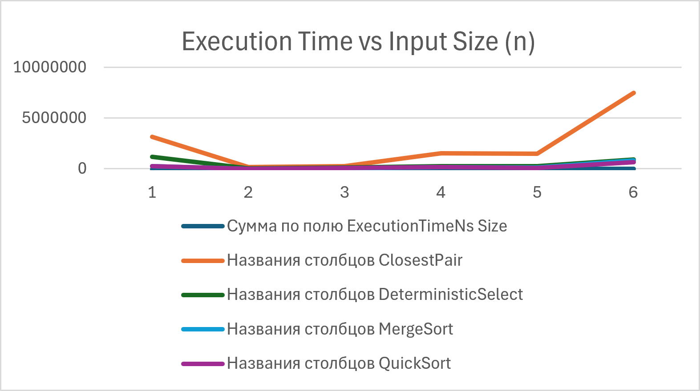
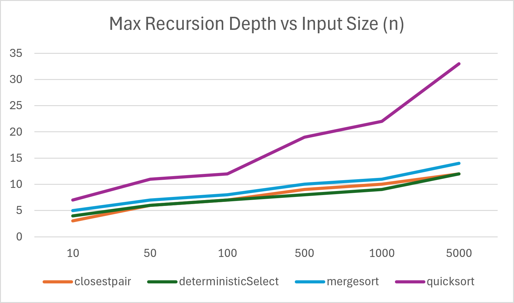
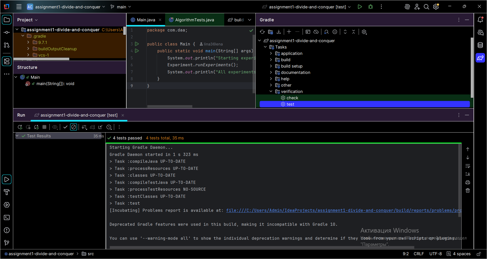

# Assignment 1: Divide-and-Conquer Algorithm Analysis

## A. Project Overview

This project implements and analyzes four divide-and-conquer algorithms in Java: Merge Sort, randomized QuickSort, Deterministic Select using Median-of-Medians, and Closest Pair of Points. The experiments compare execution time and recursion depth with the algorithms’ theoretical bounds.

The project uses Gradle. Tests are located in `src/test/java/com/daa/`.

## B. Algorithm Analysis

### Merge Sort

Merge Sort recursively splits an array in half and merges the sorted halves using a reusable auxiliary buffer. Subarrays of at most 15 elements use insertion sort.

- Recurrence: `T(n) = 2T(n/2) + Θ(n)`
- Time: `Θ(n log n)` in all cases
- Extra space: `O(n)` for the buffer and `O(log n)` for the recursion stack
- By the Master Theorem, `a = 2`, `b = 2`, and `f(n) = Θ(n)`, giving `T(n) = Θ(n log n)`.

### Randomized QuickSort

QuickSort selects a random pivot and partitions the array in place. It recurses on the smaller partition and iterates over the larger one.

- Expected time: `Θ(n log n)`
- Worst-case time: `Θ(n²)`
- Balanced recurrence: `T(n) = 2T(n/2) + Θ(n)`
- Worst-case recurrence: `T(n) = T(n − 1) + Θ(n)`
- Stack space with smaller-partition recursion: `O(log n)`

Random pivot selection reduces the chance of consistently unbalanced partitions but does not eliminate the quadratic worst case.

### Deterministic Select (Median-of-Medians)

The algorithm groups elements in fives, selects the median of each group, and uses the median of those medians as a pivot. After partitioning in place, it continues only in the partition containing the requested rank `k`.

- Recurrence: `T(n) ≤ T(⌈n/5⌉) + T(7n/10 + O(1)) + Θ(n)`
- Worst-case time: `Θ(n)`
- Extra space: `O(log n)` for the recursion stack

The recursive subproblem fractions sum to less than one, so the linear grouping and partitioning work gives a linear worst-case bound.

### Closest Pair of Points

The point set is divided around the median x-coordinate. After solving both halves, the algorithm checks the strip around the dividing line in y-order. Each point is compared with only a constant number of following points.

- Recurrence when y-order is maintained: `T(n) = 2T(n/2) + Θ(n)`
- Time: `Θ(n log n)`
- Extra space: temporary arrays and the recursion stack

Maintaining y-order allows the strip to be processed in linear time at each recursion level.

## C. Experimental Results

Execution time was measured in nanoseconds. The tables show the recorded results for each input size.

| n | Merge Sort | QuickSort | Deterministic Select | Closest Pair |
|---:|---:|---:|---:|---:|
| 10 | 585,200 | 960,700 | 3,795,500 | 5,926,400 |
| 50 | 24,500 | 89,700 | 55,300 | 263,000 |
| 100 | 61,900 | 134,800 | 94,800 | 264,800 |
| 500 | 369,100 | 634,500 | 454,700 | 2,006,800 |
| 1,000 | 176,800 | 159,200 | 270,100 | 2,045,500 |
| 5,000 | 821,600 | 742,800 | 1,099,400 | 9,221,900 |
### Maximum Recursion Depth

| n | Merge Sort | QuickSort | Deterministic Select | Closest Pair |
|---:|---:|---:|---:|---:|
| 10 | 5 | 3 | 4 | 3 |
| 50 | 7 | 4 | 6 | 6 |
| 100 | 8 | 5 | 7 | 7 |
| 500 | 10 | 6 | 8 | 9 |
| 1,000 | 11 | 7 | 9 | 10 |
| 5,000 | 14 | 9 | 12 | 12 |

Detailed experiment data: [results.csv](results/results.csv)

## D. Discussion

**Do the results match the theoretical complexity?** Runtime generally increases with input size, but individual measurements vary. JVM warm-up and system activity can affect short runs, so the tables show practical measurements rather than proving asymptotic bounds.

**How does input structure affect performance?** Merge Sort has the same asymptotic complexity for different array orders. QuickSort’s practical performance depends on partition balance and how equal values are handled. Random pivots make repeated poor splits less likely. Input distributions can also change measured runtimes for selection and closest pair.

**Why recurse on the smaller QuickSort partition?** The smaller partition contains at most about half the current elements. Recursing on it and iterating over the larger side bounds stack depth by `O(log n)`.

**Why does Median-of-Medians guarantee `O(n)`?** Its pivot discards a constant fraction of the elements. The recurrence has subproblem fractions `1/5` and `7/10`, whose sum is less than one; grouping and partitioning add only linear work.

**Why is divide-and-conquer Closest Pair faster than brute force?** Brute force checks every pair in `Θ(n²)` time. Divide-and-conquer solves two half-size problems and processes the y-ordered strip in linear time per level, giving `Θ(n log n)` overall.

**What practical factors affect performance?** JVM JIT compilation, garbage collection, CPU cache behavior, allocations, system load, and timer granularity can all affect measured runtime.

## E. Reflection

Working on this assignment helped me understand the difference between theoretical complexity and measured runtime. The measurements for small inputs showed how setup costs and JVM warm-up can affect a benchmark.

The most challenging part was keeping the recursive steps and edge cases clear across different algorithms. Comparing results with reference methods helped me separate correctness from performance.

## F. Screenshots

## Testing

The Gradle test run completed with **4 tests passed**. Tests are located in `src/test/java/com/daa/`.

## GitHub Workflow

The project uses Gradle and includes its source code, tests, results, plots, screenshots, and README. The Git history should reflect the actual development process.
