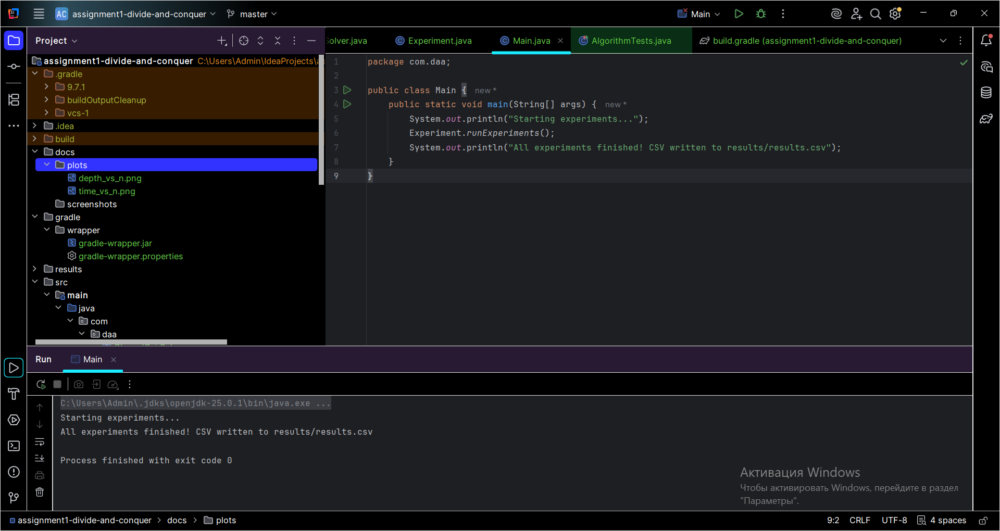

# Assignment 1: Divide-and-Conquer Algorithm Analysis

## A. Project overview

This project implements and studies four divide-and-conquer algorithms in Java: Merge Sort, randomized QuickSort, deterministic selection with Median-of-Medians, and the closest pair of points in two dimensions. The goal is to compare their algorithmic guarantees with measured runtime and recursion depth, and to validate their results against reference implementations.

## Repository layout

```text
assignment1-divide-and-conquer/
├── docs/
│   ├── plots/
│   │   ├── time_vs_n.png
│   │   └── depth_vs_n.png
│   └── screenshots/
├── results/
├── src/
│   ├── main/java/com/daa/
│   │   ├── ClosestPairSolver.java
│   │   ├── DeterministicSelector.java
│   │   ├── Experiment.java
│   │   ├── Main.java
│   │   ├── MergeSorter.java
│   │   ├── Point.java
│   │   └── QuickSorter.java
│   └── test/java/com/daa/
├── build.gradle
├── gradlew
└── gradlew.bat
```

This repository uses Gradle. Run tests from the project root with `./gradlew test` (Windows: `./gradlew.bat test`).

## B. Algorithm analysis

### Merge Sort

The array is split into two halves, each half is sorted recursively, and a linear merge combines them. The implementation uses a reusable auxiliary buffer and switches to insertion sort for subarrays of at most 15 elements.

- Recurrence: `T(n) = 2T(n/2) + Θ(n)`
- Time: `Θ(n log n)` in the best, average, and worst cases
- Extra space: `O(n)` for the auxiliary buffer and `O(log n)` for the recursion stack
- Master Theorem: `a = 2`, `b = 2`, and `f(n) = Θ(n)`, so this is Case 2 and `T(n) = Θ(n log n)`.

### Randomized QuickSort

A pivot is selected at random and the array is partitioned in place. The algorithm recurses on the smaller partition and processes the larger partition iteratively. This bounds call-stack depth independently of the amount of work required by a bad partition sequence.

- Expected time: `Θ(n log n)`
- Worst-case time: `Θ(n²)`
- Recurrence for a balanced split: `T(n) = 2T(n/2) + Θ(n)`
- Worst-case recurrence: `T(n) = T(n − 1) + Θ(n)`
- Stack space: `O(log n)` with smaller-partition recursion

Randomized pivot selection makes consistently poor splits less likely; it does not remove the quadratic worst case.

### Deterministic Select (Median-of-Medians)

Elements are divided into groups of five. The median of each group is found, and the median of those medians is used as the pivot. After an in-place partition, selection continues only in the partition containing the requested rank `k`.

- Recurrence: `T(n) ≤ T(⌈n/5⌉) + T(7n/10 + O(1)) + Θ(n)`
- Worst-case time: `Θ(n)`
- Auxiliary space: `O(log n)` recursion stack

The two recursive subproblem fractions sum to less than one (`1/5 + 7/10 < 1`). Together with linear work for grouping and partitioning, this gives a linear worst-case bound by Akra–Bazzi intuition (or a standard substitution argument).

### Closest Pair of Points

Points are divided around the median x-coordinate. The algorithm finds the closest pair in each half, then examines points within distance `d` of the dividing line, where `d` is the smaller half-result. The strip is processed in y-order, comparing only a constant number of subsequent points for each point.

- Recurrence with y-order maintained through the recursion: `T(n) = 2T(n/2) + Θ(n)`
- Time under that implementation: `Θ(n log n)` by the Master Theorem
- Space: temporary arrays and recursion stack; exact auxiliary-space use depends on the implementation

Maintaining y-order is essential for the linear strip scan. If the strip is re-sorted at every recursive level, the recurrence and overall runtime change; see `ClosestPairSolver.java` for the implementation details.

## C. Experimental results

The following timing and depth values are the measurements currently recorded in this project README. The benchmark protocol does not currently identify the input distribution, number of repetitions, warm-up procedure, Java version, or machine. These details should be added from the actual experiment before treating the values as a controlled comparison. `System.nanoTime()` should be used for elapsed-time measurements.

### Execution time (nanoseconds)

| n | Merge Sort | QuickSort | Deterministic Select | Closest Pair |
|---:|---:|---:|---:|---:|
| 10 | 246,000 | 268,900 | 1,166,900 | 3,136,700 |
| 50 | 17,500 | 14,800 | 32,700 | 164,900 |
| 100 | 38,300 | 80,700 | 114,000 | 263,200 |
| 500 | 173,800 | 172,600 | 246,600 | 1,522,300 |
| 1,000 | 141,900 | 87,300 | 264,300 | 1,503,100 |
| 5,000 | 817,900 | 664,300 | 913,900 | 7,495,900 |

### Maximum recursion depth

| n | Merge Sort | QuickSort | Deterministic Select | Closest Pair |
|---:|---:|---:|---:|---:|
| 10 | 5 | 7 | 4 | 3 |
| 50 | 7 | 11 | 6 | 6 |
| 100 | 8 | 12 | 7 | 7 |
| 500 | 10 | 19 | 8 | 9 |
| 1,000 | 11 | 22 | 9 | 10 |
| 5,000 | 14 | 33 | 12 | 12 |

**QuickSort depth check:** the recorded depth values should be verified against the implementation and the definition of the metric. Recursing only on the smaller partition should keep the call-stack depth `O(log n)`; in particular, the recorded values 19 for `n = 500` and 33 for `n = 5,000` need explanation before submission.

### Results by input type

The rubric asks for random, sorted, reverse-sorted, and duplicate-heavy inputs where applicable. The current timing table does not identify which input type produced its values, so this section must be filled from the experiment output. Do not copy one timing series into all rows.

| Algorithm | Input type | Sizes measured | Result file / table |
|---|---|---|---|
| Merge Sort | Random / sorted / reverse-sorted / duplicate-heavy | [add tested sizes] | [add measured results or CSV columns] |
| QuickSort | Random / sorted / reverse-sorted / duplicate-heavy | [add tested sizes] | [add measured results or CSV columns] |
| Deterministic Select | Random / sorted / reverse-sorted / duplicate-heavy | [add tested sizes] | [add measured results or CSV columns] |
| Closest Pair | Random point sets (and other tested distributions) | [add tested sizes] | [add measured results or CSV columns] |

### Plots and data

- [Execution time vs. n](docs/plots/time_vs_n.png)
- [Recursion depth vs. n](docs/plots/depth_vs_n.png)
- CSV results: [results.csv](results/results.csv)


## D. Discussion

**Do the measurements match the theoretical complexity?** The values generally rise as input size grows, but the series is small and its input distribution and measurement protocol are not recorded here. The irregular values, especially at small `n`, mean this table alone cannot verify asymptotic growth. Repeated measurements with JVM warm-up and controlled inputs would make the comparison more useful.

**How does input structure affect performance?** Merge Sort has the same asymptotic bound for random, sorted, reverse-sorted, and duplicate-heavy arrays. QuickSort's pivot sequence and handling of equal keys can change partition balance and runtime; random pivots reduce the chance of repeatedly poor splits, while the worst case remains `Θ(n²)`. For selection and closest pair, the input distribution can affect practical timings even when the theoretical bound is unchanged.

**Why recurse on the smaller QuickSort partition?** The smaller partition has no more than about half the elements. Recursing on that side and iterating over the larger side therefore bounds call-stack depth by `O(log n)`, helping avoid stack overflow. This controls stack use, not worst-case running time.

**Why does Median-of-Medians guarantee `O(n)`?** The pivot derived from medians of groups of five guarantees that a constant fraction of elements can be discarded, up to small-size rounding terms. The recurrence `T(n) ≤ T(n/5) + T(7n/10 + O(1)) + Θ(n)` has total recursive fractions below one, so the total work is linear.

**Why is divide-and-conquer Closest Pair faster than brute force?** Brute force checks all pairs and takes `Θ(n²)` time. The divide-and-conquer method solves two half-size instances and processes the y-ordered strip in linear time per level, giving `Θ(n log n)` overall.

**What practical factors affect the measurements?** JVM JIT compilation and warm-up, garbage collection, CPU cache behavior, allocation patterns, operating-system scheduling, processor load, and timer granularity can all affect elapsed times. Record the Java version and machine, warm up the code, repeat runs, and summarize results consistently (for example, with a median).

## E. Reflection

[Replace this paragraph with your own reflection.] Describe one concept you understand better after the assignment and one concrete implementation decision you found challenging. For example, explain how you handled the closest-pair strip ordering, tracked QuickSort stack depth, or tested selection around duplicate values—only use details that match your own work.

[Add a second paragraph if useful.] Explain what you would change in your implementation or experiment if you had more time. Keep the reflection in your own words so it represents your experience rather than a generic algorithm summary.

## F. Screenshots

Add readable screenshots to `docs/screenshots/` and link the actual files below. Include a program-output screenshot, a test-results screenshot, and screenshots of the plots/results.

- Program output: 
- Test results: 
- Plots/results: 

## Testing

The test suite is under `src/test/java/com/daa/`. The assignment's correctness checks should include:

- Merge Sort and QuickSort compared with `Arrays.sort()` on random, sorted, reverse-sorted, duplicate-heavy, empty, and single-element arrays.
- At least 100 random Deterministic Select cases compared with the element at index `k` after sorting a copy of the input.
- Closest Pair compared with an `O(n²)` brute-force reference on small datasets up to `n = 2,000`; use the fast implementation for larger datasets.

Test run: [add the actual command, date/environment if required, and passing/failing summary after running `./gradlew test`]. Do not claim that these checks passed until the current test run confirms it.

## GitHub workflow

The repository uses Gradle (`build.gradle` and the Gradle wrapper), so the Maven `pom.xml` shown in the sample structure is not applicable to this project. Keep the actual source, tests, plots, screenshots, CSV results, and README committed in their corresponding folders. The Git history should describe the work that actually happened; use focused commits for implementation, experiments, tests, documentation, and fixes, without inventing or backdating commits.
